<picture><source media="(max-width: 768px) and (prefers-color-scheme: dark)" srcset="assets/header-mobile-dark.svg"><source media="(max-width: 768px)" srcset="assets/header-mobile-light.svg"><source media="(prefers-color-scheme: dark)" srcset="assets/header-dark.svg"></picture> 
<a href="https://anatolimonsalve.com"><picture><source media="(max-width: 768px) and (prefers-color-scheme: dark)" srcset="assets/link-website-mobile-dark.svg"><source media="(max-width: 768px)" srcset="assets/link-website-mobile-light.svg"><source media="(prefers-color-scheme: dark)" srcset="assets/link-website-dark.svg"></picture></a>&nbsp;
<a href="https://www.linkedin.com/in/anatoli-monsalve/"><picture><source media="(max-width: 768px) and (prefers-color-scheme: dark)" srcset="assets/link-linkedin-mobile-dark.svg"><source media="(max-width: 768px)" srcset="assets/link-linkedin-mobile-light.svg"><source media="(prefers-color-scheme: dark)" srcset="assets/link-linkedin-dark.svg"></picture></a>&nbsp;
<a href="mailto:afm88@cornell.edu"><picture><source media="(max-width: 768px) and (prefers-color-scheme: dark)" srcset="assets/link-email-mobile-dark.svg"><source media="(max-width: 768px)" srcset="assets/link-email-mobile-light.svg"><source media="(prefers-color-scheme: dark)" srcset="assets/link-email-dark.svg"></picture></a> 
<picture><source media="(max-width: 768px) and (prefers-color-scheme: dark)" srcset="assets/card-mobile-dark.svg"><source media="(max-width: 768px)" srcset="assets/card-mobile-light.svg"><source media="(prefers-color-scheme: dark)" srcset="assets/card-dark.svg"></picture>
